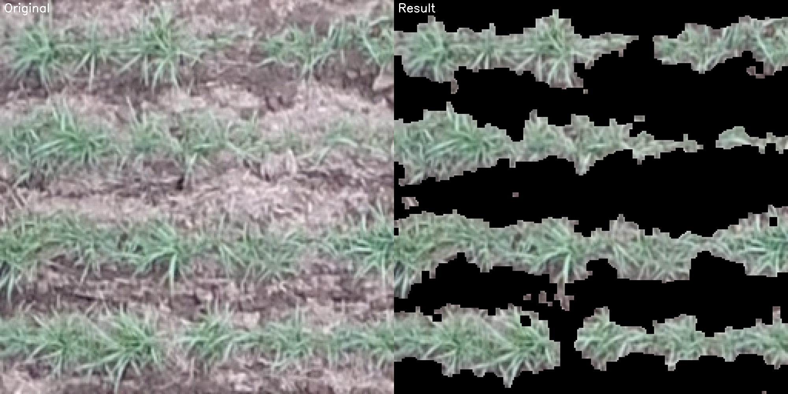
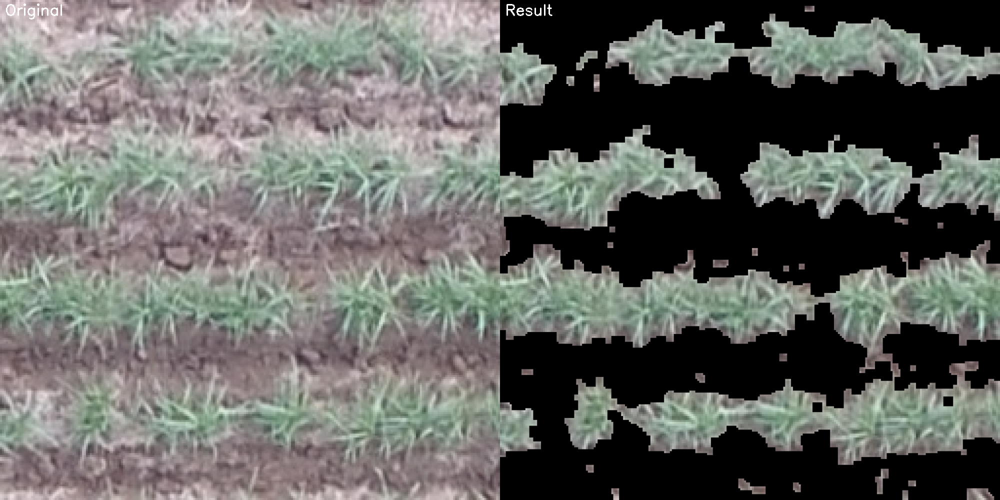

# Relatório de progresso

Aqui pe feita a documentação das etapas do desafio.

## Quebra da imagem em blocos

Primeiramente a imagem foi quebrada em blocos de 256x256 para geração de dataset. Foi utilizado o opencv para isso e o formato de jpg. As que ficaram com largura ou altura menor que 160 foram descartadas e foi realizado um redimensionamento das restantes para que todas tivessem esse tamanho.

## Geração do dataset

### Geração da máscara binária

Para treinar um modelo de segmentação é necessária uma máscara binária. Ela foi gerada utilizando clusterização dos pixels em 3 grupos. Mais próximos de verde, mais próximos de marrom e indefinidos. Depois foi feito um pós processamento de dilatação e erosão.

O resultado pode ser visto nas imagens a seguir.

### Dataset de treino e validação

### Aumento do dataset

## Implementação e treinamento da rede neural

### Implementação da rede neural

### Treinamento da rede neural
